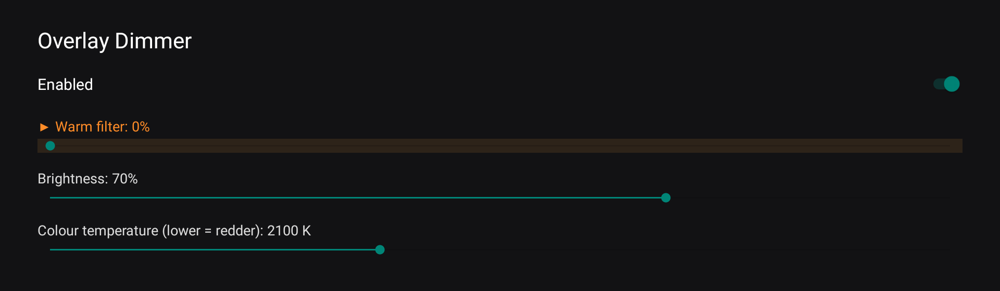
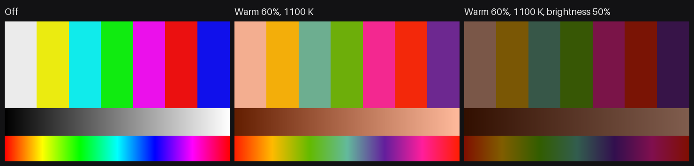

# MidnightBeam

A tiny screen dimmer and warm (red) filter for **Android TV boxes, projectors and TVs** that can be controlled
**live from ADB or Home Assistant**, as well as with the TV remote.

It draws a click-through overlay above everything, video included, like the usual blue-light filter apps.
The difference is that changes apply instantly, with no flash to full brightness. Other filter apps usually have
to be restarted to pick up new values from automation tools.

- **Live control** from `adb shell` / Home Assistant: warm filter, brightness, colour temperature
- **Phone remote**: scan a QR code on the TV and control it from any phone browser (Android or iPhone),
  no app to install; the page works offline, on the local network only
- **Phone app mode**: on a phone or tablet the app itself is the remote page, for the phone's own filter and for
  every TV you saved
- **Daily or weekly schedule**: a timeline of time slots (movie night, early to bed…) that the TV applies by itself,
  even with the phone off; shown as a bar at the bottom of the TV screen
- **Remote-friendly settings screen**: only D-pad and OK are needed, with a visible focus highlight
  for the many TV-box themes that show none
- **Restores the last setting at boot**, early: the boot receiver has a high priority, because on some boxes
  `BOOT_COMPLETED` reaches apps one at a time and can take over a minute
- **Small**: ~330 KB APK (most of it the artwork), plain Java, no tracking; no internet connections: the network is used only
  by the optional LAN remote (port 8765, pairing key, off unless enabled) and, in phone app mode, to reach your paired TVs
- Android 8.0+ (API 26), phones work too


<sub>The settings screen as rendered by the app on a 1080p Android TV projector (the focused row is highlighted).</sub>


<sub>Effect on a test pattern, simulated with the same colour and blending formula the app uses
(real screen captures do not include overlays on many TV boxes).</sub>

New in 1.5: the app is now called **MidnightBeam** (new package id `dev.midnightbeam`, so the previous
RedMoonBeam app has to be uninstalled and this one installed; settings are not carried over), with new artwork.
The old name was too close to the existing Red Moon app.

## Install

1. Download `midnightbeam.apk` from the [latest release](../../releases/latest).
2. Install and allow drawing over other apps:

   ```sh
   adb install midnightbeam.apk
   adb shell appops set dev.midnightbeam SYSTEM_ALERT_WINDOW allow
   ```

   Without ADB: install the APK with a file manager, then enable
   *Settings → Apps → Special app access → Display over other apps → MidnightBeam*.
3. Open **MidnightBeam** from the app list once and set it up.

## Remote control

Open the app from the launcher:

| Key | Action |
|---|---|
| Up / Down | move between the switch and the sliders |
| Left / Right | change the focused value (applied immediately) |
| OK | switch the filter on / off |

## Phone remote and schedule

1. In the app on the TV, turn on **Phone remote**: a QR code appears.
2. Scan it with the phone camera. The page opens in the browser; *Add to Home screen* makes it an app icon.
3. Move the sliders or pick a preset: the TV follows instantly.
4. **Schedule** (built with [dayrhythm](https://github.com/MadeinTaly/dayrhythm)): pick a day preset, tap a
   time slot to choose its setting (a profile or a custom one), rename or remove it, add slots, drag the edges
   between slots to set the times. Every change is **saved to the TV automatically**; there is no Apply button.
   The TV switches slot by itself; a manual change lasts until the next slot.
   **Save this day** keeps a named day on the TV, available to every paired phone.
5. **Transition** (Off, 15, 30 or 60 minutes): values glide gradually into the next slot.
6. **Weekly mode**: switch from *Same every day* to *Per weekday* to give each weekday its own slots
   (with a copy-to-other-days shortcut).
7. **Add to Home screen**: the page has a button that installs it as an app icon (on iPhone: Share, then
   Add to Home Screen).

### Phone app mode and saved devices

On a phone or tablet, the launcher opens the remote page inside the app (a WebView):

- **This device** controls the phone's own overlay. While the app is open, the page is served on
  `127.0.0.1:8765` only (other devices cannot reach it); it is served on the network only when *Phone remote* is
  on (TV only, or `--ez remote true`). The pairing key is still checked. The app asks you to allow
  *Display over other apps*, which the overlay needs.
- **Saved devices**: tap the bar at the top to list them, switch between them, rename or delete them.
- **Pairing a TV**: scan its QR code. The code is still the plain `http://IP:8765/#k=KEY` link, so without the app
  it just opens the page in the browser. With the app installed the link opens the app (on older Android you may
  need to allow it in *Settings → Apps → MidnightBeam → Open by default*, or use the button below) and saves the TV.
- **Open in the app**: on an Android browser, the remote page shows this button, which hands the TV to the app
  (`midnightbeam://add?host=…&port=…&k=…&name=…`) or, if the app is not installed, opens the download page.
  Inside the app, it and *Add to Home screen* are hidden.

The page is in English, or Italian on Italian phones (switchable with EN | IT); the TV app follows the
device language.

The QR code carries a random pairing key: requests without it are refused. **New pairing code** on the TV
disconnects every paired phone. The remote works only while the phone is on the same network as the TV.

HTTP API (port 8765, header `X-Key: <pairing key>`), handy for scripts:

```sh
curl -H "X-Key: $KEY" http://TV-IP:8765/api/info      # {"name":..,"model":..}
curl -H "X-Key: $KEY" http://TV-IP:8765/api/state
curl -H "X-Key: $KEY" -H "Content-Type: application/json" -d '{"red":60,"bright":40}' http://TV-IP:8765/api/set
curl -H "X-Key: $KEY" http://TV-IP:8765/api/schedule
curl -H "X-Key: $KEY" http://TV-IP:8765/api/days
```

## Android 12 and later

Android 12 blocks touches through an overlay of another app unless the overlay is at most 80% opaque (the system limit, `InputManager.getMaximumObscuringOpacityForTouch()`). MidnightBeam therefore caps the filter at that opacity, so the phone stays usable; `/api/state` and `dumpsys` report `clamped` when the requested darkness was limited.

For full darkness, covering the status and navigation bars, you can optionally enable MidnightBeam in Settings > Accessibility. The service only lends its window to draw the dimming overlay: it requests no access to window content, does not read the screen or your input, and sends nothing anywhere. Without it, everything works as described above.

## ADB commands

```sh
# warm filter 0-100, brightness 5-100 (100 = no dimming), colour temperature 1000-6500 K
adb shell am start-foreground-service -n dev.midnightbeam/.DimService --ei red 60 --ei bright 40 --ei temp 1100

# change a single value, the others are kept
adb shell am start-foreground-service -n dev.midnightbeam/.DimService --ei bright 70

# off
adb shell am start-foreground-service -n dev.midnightbeam/.DimService --ez off true

# phone remote on / off
adb shell am start-foreground-service -n dev.midnightbeam/.DimService --ez remote true

# current state
adb shell dumpsys activity service dev.midnightbeam/.DimService
```

Lower colour temperature means redder: 1000-1200 K is a deep red, 1800 K orange, 3000 K+ yellowish.

The service can only be controlled by the app itself and from `adb shell` / root. It is protected by the
`DUMP` permission, so other apps cannot change it.

## Home Assistant

The [`homeassistant/`](homeassistant) folder has a ready-made example:

- [`midnightbeam.yaml`](homeassistant/midnightbeam.yaml): package with sliders, presets and state
  sensors, using the built-in **Android Debug Bridge** integration (`androidtv.adb_command`)
- [`dashboard.yaml`](homeassistant/dashboard.yaml): example dashboard
- [`status.sh`](homeassistant/status.sh): optional script that prints the state as JSON for the sensors

Replace `media_player.my_tv` with your own entity and copy `status.sh` to the device:

```sh
adb push homeassistant/status.sh /data/local/tmp/midnightbeam-status.sh
```

## Build

No Gradle and no Android SDK manager. On Debian / Ubuntu:

```sh
sudo apt install openjdk-17-jdk-headless dalvik-exchange aapt zipalign apksigner android-sdk-platform-23
./build.sh
```

With the Android SDK instead of the Debian packages:

```sh
BUILD_TOOLS=$ANDROID_HOME/build-tools/34.0.0 ANDROID_JAR=$ANDROID_HOME/platforms/android-28/android.jar ./build.sh
```

The first build creates a local `debug.keystore` to sign the APK.

The schedule editor library is the git submodule `vendor/dayrhythm`: run `git submodule update --init`
(or clone with `--recurse-submodules`) before building. `build.sh` copies its plain ES module sources
(`src/`, nothing minified) into the APK as `assets/dayrhythm/`, and the phone page imports them as modules.

The phone remote page is `web/remote.html`, styled with Tailwind CSS compiled at development time
(`web/build-css.sh`, needs Node; sources: `web/input.css`, `web/tailwind.config.js` and the classes used in `web/remote.html`;
it also copies the page into `app/assets/`). The generated `app/assets/remote.css` is committed, so building the APK
does not need Node and the page has no CDN dependency. APKs signed with different keys cannot
update each other, so uninstall the release build before installing your own.

## Notes

- It is an overlay: it darkens and tints the picture but cannot lower the real backlight or LED power.
- The colour comes from Tanner Helland's black-body approximation
  ([source](https://tannerhelland.com/2012/09/18/convert-temperature-rgb-algorithm-code.html)).

## Third-party

- [QR Code generator library](https://www.nayuki.io/page/qr-code-generator-library) by Project Nayuki,
  MIT License (`app/src/io/nayuki/qrcodegen`, unmodified)
- [Tailwind CSS](https://tailwindcss.com), MIT License (compiled into `app/assets/remote.css`)
- [dayrhythm](https://github.com/MadeinTaly/dayrhythm), MIT License (git submodule `vendor/dayrhythm`, v0.2.0, used unminified from its `src/`; the schedule editor of the phone page)

## Support

If MidnightBeam is useful to you, you can support its development here: https://gt.1471995.xyz

## License

[MIT](LICENSE)
